## Описание работы

Отчет по нагрузочному тестированию по теме "Производительность индексов" в рамках курса "Highload Architect".


## Содержание

#### 1. [Описание работы](#описание-работы)  
#### 2. [Содержание](#Содержание)  
#### 3. [Введение](#Введение)  
#### 4. [Постановка задачи](#постановка-задачи)  
#### 5. [Что тестируем](#что-тестируем)  
#### 6. [Чем тестируем](#чем-тестируем)  
#### 7. [Где тестируем](#где-тестируем)  
#### 8. [Как тестируем](#как-тестируем)  
#### 9. [Нагрузочное тестирование](#нагрузочное-тестирование)  
#### 10. [Наполнение базы данных пользователями](#наполнение-базы-данных-пользователями)  
#### 11. [Создание JMeter сценари](#создание-JMeter-сценария)  
#### 12. [Метод для получения списка пользователей](#метод-для-получения-списка-пользователей)  
#### 13. [Нагрузочное тестирование до создания индекса 1 пользователем](#нагрузочное-тестирование-до-создания-индекса-1-пользователем)
#### 14. [Нагрузочное тестирование до создания индекса 50 пользователями](#нагрузочное-тестирование-до-создания-индекса-50-пользователями)
#### 15. [Нагрузочное тестирование до создания индекса 1000 пользователями](#нагрузочное-тестирование-до-создания-индекса-1000-пользователями)
#### 16. [Создание индекса для базы данных](#создание-индекса-для-базы-данных)
#### 17. [Нагрузочное тестирование после создания индекса 1 пользователем](#нагрузочное-тестирование-после-создания-индекса-1-пользователем)
#### 18. [Нагрузочное тестирование после создания индекса 50 пользователями](#нагрузочное-тестирование-после-создания-индекса-50-пользователями)
#### 19. [Нагрузочное тестирование после создания индекса 1000 пользователями](#нагрузочное-тестирование-после-создания-индекса-1000-пользователями)
#### 20. [Нагрузочное тестирование V2](#нагрузочное-тестирование-V2)
#### 21. [Измененный SQL скрит для обращения в базу данных](#измененный-скрит-для-обращения-к-базе-данных)
#### 22. [Измененные индексы для базы данных](#измененные-индексы-для-базы-данных)
#### 23. [Нагрузочное тестирование до создания индекса 1000 пользователями V2](#нагрузочное-тестирование-до-создания-индекса-1000-пользователем-V2)
#### 24. [Нагрузочное тестирование после создания индекса 1000 пользователями V2](#нагрузочное-тестирование-после-создания-индекса-1000-пользователем-V2)
#### 25. [Получение query plan при получении данных из таблицы с созданными индексами V2](#получение-query-plan-при-получении-данных-из-таблицы-с-созданными-индексами-V2)
#### 26. [Итоговые данные](#итоговые-данные)
#### 27. [Заключение](#Заключение)
#### 28. [Материалы](#материалы)

# Введение

В рамках выполнения ДЗ мы воспользуемся и создадим набор тестовых данных для проведения нагрузочного тестирования, подберем наиболее подходящие индексы и проведем тесты производительности.
В данном задании тренируются навыки:
- (опционально) генерация тестовых данных;
- работа с индексами;
- нагрузочное тестирование;

## Постановка задачи

Пошаговая инструкция выполнения домашнего задания:

- Сгенерировать любым способ 1,000,000 анкет. Имена и Фамилии должны быть реальными, чтобы учитывать селективность индекса. Так же можно воспользовать уже готовым списком как основой.
- Реализовать функционал поиска анкет по префиксу имени и фамилии (одновременно) в вашей социальной сети (реализовать метод /user/search из спецификации) (запрос в форме firstName LIKE ? and secondName LIKE ?). Сортировать вывод по id анкеты.
- Провести нагрузочные тесты этого метода. Поиграть с количеством одновременных запросов. 1/10/100/1000.
- Построить графики и сохранить их в отчет
- Сделать подходящий индекс.
- Повторить пункт 3 и 4.

В качестве результата предоставить отчет в котором должны быть:

- графики latency до индекса;
- графики throughput до индекса;
- графики latency после индекса;
- графики throughput после индекса;
- запрос добавления индекса;
- explain запросов после индекса;
- объяснение почему индекс именно такой;

## Что тестируем

В качестве объекта тестирования будет использоваться приложение, написанное в рамках предыдущего задания - SwipeVibe. 
Приложение использует `.Net 8.0` (`minimal api`), EF Core (с использованием `executeSqlRaw` и чистого `SQL`) в качестве `ORM` и `PostgreSQL` в качестве базы данных.

## Чем тестируем

Для тестирования будут взяты следующие инструменты:

- Jmeter - инструмент для проведения нагрузочного тестирования, которым мы будем нагружать наше приложение;
- Grafana - интерфейс для визуализации данных, полученных из Jmeter, чтобы [визуализировать результат тестирования Jmeter](https://github.com/testsmith-io/jmeter-influxdb-grafana-docker);
- Docker compose - средство для определения и запуска приложений Docker с несколькими контейнерами, в нашем случае это само приложение и база данных.

## Где тестируем

В качестве теста для тестирования будет использоваться локальная машина со следующими характеристиками:
- Процессор: AMD Ryzen 9 7900X 12-Core Processor
- Оперативная память: G.Skill 64 ГБ 6000 МГц
- SSD: Samsung SSD 970 PRO

PS: на удаленном сервере не удалось оперативно развернуть базу с данными из `.csv`.

## Как тестируем

Тестирование будет проходить согласно постановке задачи.
Для начала, мы наполним базу данных необходимым количеством пользователей с помощью `Datagrip` и `.csv` выгрузки с пользователями. 
Далее, настроим JMeter на следующие параметры:
- 1 пользователь в секунду;
- 50 пользователей в секуду;
- 1000 пользователей в секунду.
Замеряем и зафисируем параметры из постановки по результату нагрузочного тестирования. Время тестирования ~10 минут на тест.
Далее, мы создадим индексы для базы данных (таблиц) и повторим тестирование, аналогично замеряя и фиксируя результаты.
После замеров, будет составлен отчет и оценка тому, как отработали индексы.

## Нагрузочное тестирование

### Наполнение базы данных пользователями

В первую очередь, требуется наполнить базу данных пользовательскими данными. 
Для этого воспользуемся [немного измененной заготовкой](swipe-vibe-people-import.csv) `.csv`. Выглядит она так:


Импортируем этот файл во временно созданную таблицу базы данных c помощью `DataGrip`

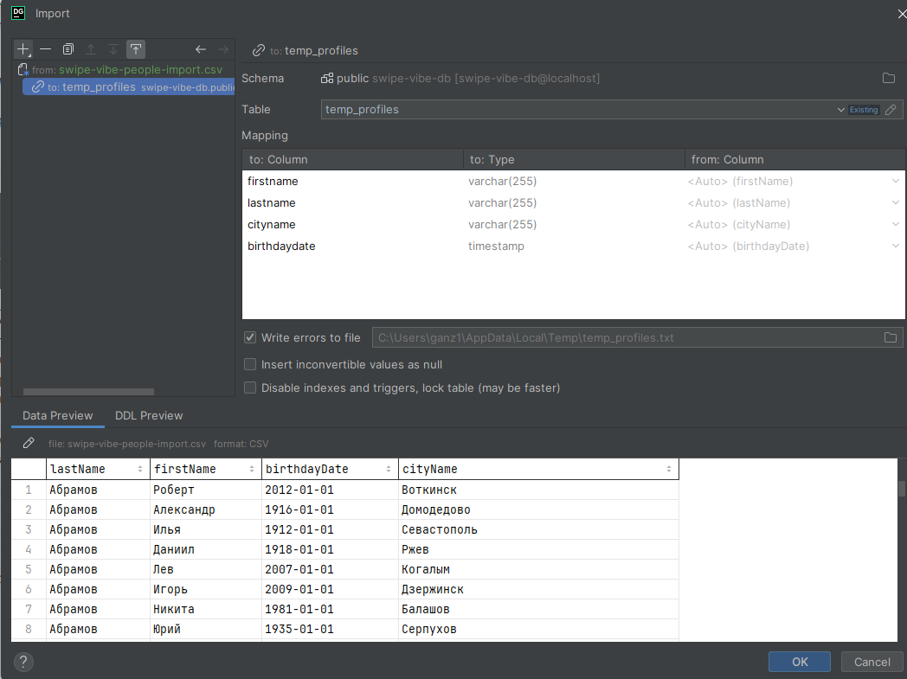

А затем с помощью добавленной генерации и данных временной таблицы делаем `Insert` в целевые:

```

BEGIN;

INSERT INTO "Users" ("UserId", "Msisdn", "PasswordHash")
SELECT
    uuid_generate_v4() AS UserId,
    lpad(floor(random() * 99999999999)::text, 11, '0') AS Msisdn,
    'D8578EDF8458CE06FBC5BB76A58C5CA4' AS PasswordHash
FROM temp_profiles
ON CONFLICT ("Msisdn") DO NOTHING;


INSERT INTO "Profiles" ("ProfileId", "UserId", "FirstName", "LastName", "BirthdayDate", "Gender", "Description", "CityName")
SELECT
    uuid_generate_v4() AS ProfileId,
    u."UserId",
    p.FirstName,
    p.LastName,
    p.birthdaydate,
    floor(random() * 2) + 1 AS Gender,
    'Путешествия, музыка',
    p.cityname
FROM (
    SELECT
        ROW_NUMBER() OVER () AS row_num,
        p.*
    FROM temp_profiles p
) p
JOIN (
    SELECT
        ROW_NUMBER() OVER () AS row_num,
        u.*
    FROM "Users" u
) u ON p.row_num = u.row_num
LEFT JOIN "Profiles" pr ON u."UserId" = pr."UserId"
WHERE pr."UserId" IS NULL;

COMMIT


```

В результатер работы скрипта, у нас создасться ~996K пользователей.

### Создание JMeter сценария

Теперь создадим сценарий для тестирования через Jmeter. Кратко об особенностях:
- Проставленный заранее токен аутентификации одного из созданных пользователей;
- Параметры для фильтра берутся из того же `.csv` файла;
- 1/1/infinity loop;
- Подключили дополнительно плагин для получения `latency` - `3 Basic Graph`;
- Подключили Grafana для отображения графиков.

Файл JMeter сценария [доступен по ссылке.](LoadUserData.jmx)

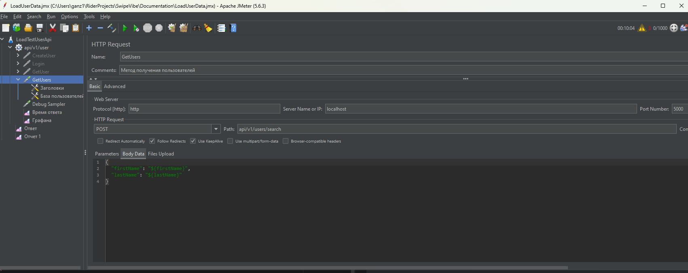

### Метод для получения списка пользователей

В качестве тестирования возьмем метод для получения списка пользователей (анкет). Выглядит он так:

```
 public async Task<List<ProfileModelDb?>> GetProfilesByFilter(Guid userId, string firstName, string lastName)
    {
        return await context.Profiles.FromSqlRaw(@"
            SELECT 
                p.""ProfileId"",
                p.""UserId"", 
                p.""FirstName"", 
                p.""LastName"", 
                p.""BirthdayDate"", 
                p.""Gender"",
                p.""Description"", 
                p.""CityName"" 
            FROM ""Profiles"" p
            WHERE 
                p.""UserId"" != {0}
                AND 
                (
                    p.""FirstName"" LIKE '%' || {1} || '%'
                    OR 
                    p.""LastName"" LIKE '%' || {2} || '%'
                )
            ORDER BY p.""ProfileId"" ASC", userId, firstName, lastName)
            .ToListAsync();
    }
```

### Нагрузочное тестирование до создания индекса 1 пользователем

Результат тестирования:


### Нагрузочное тестирование до создания индекса 50 пользователями

Результат тестирования:


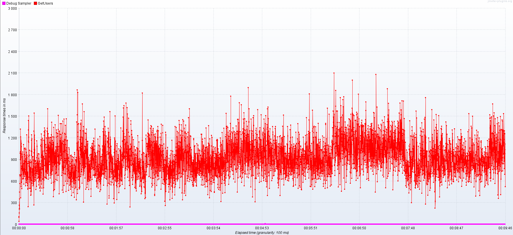
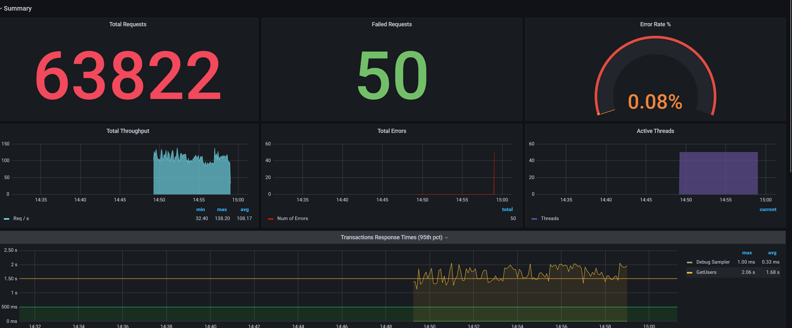


### Нагрузочное тестирование до создания индекса 1000 пользователями

Результат тестирования:


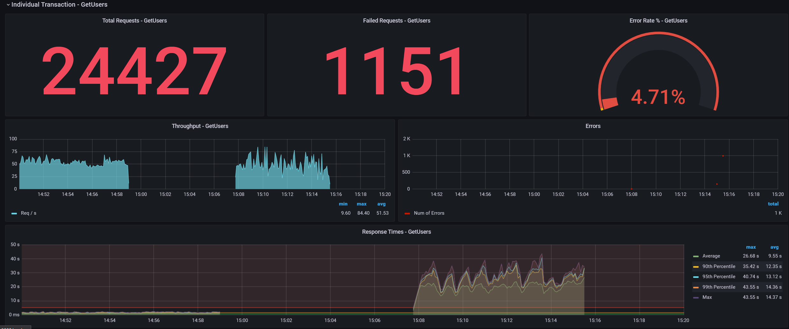

### Создание индекса для базы данных

В качестве индексов было выбрано следующее:
- Индекс на UserId: Условие p."UserId" != {0} требует проверки всех значений, поэтому индекс поможет ускорить эту операцию;
- GIN индексы на FirstName и LastName поможет так как операции LIKE лучше всего ускоряются с помощью GIN индексов для более эффективного поиска подстрок;
- Индекс на ProfileId: Ускоряет сортировку результата запроса по этому полю.

Скрипт для создания индексов:

```
-- Индекс для ускорения условия на UserId
CREATE INDEX "IX_Profiles_UserId_NotEqual"
ON "Profiles" ("UserId");

-- GIN индекс для ускорения поиска по шаблону в FirstName
CREATE INDEX "IX_Profiles_FirstName_trigram"
ON "Profiles" USING gin ("FirstName" gin_trgm_ops);

-- GIN индекс для ускорения поиска по шаблону в LastName
CREATE INDEX "IX_Profiles_LastName_trigram"
ON "Profiles" USING gin ("LastName" gin_trgm_ops);

-- Индекс для ускорения сортировки по ProfileId
CREATE INDEX "IX_Profiles_ProfileId_Order"
ON "Profiles" ("ProfileId");

```

### Нагрузочное тестирование после создания индекса 1 пользователем

Результат тестирования:


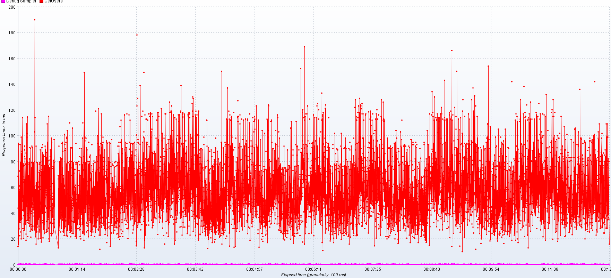


### Нагрузочное тестирование после создания индекса 50 пользователями

Результат тестирования:


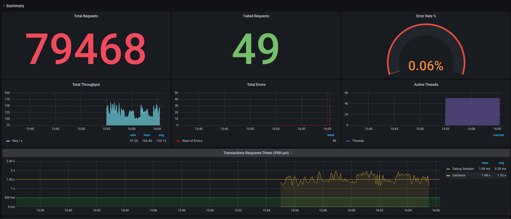
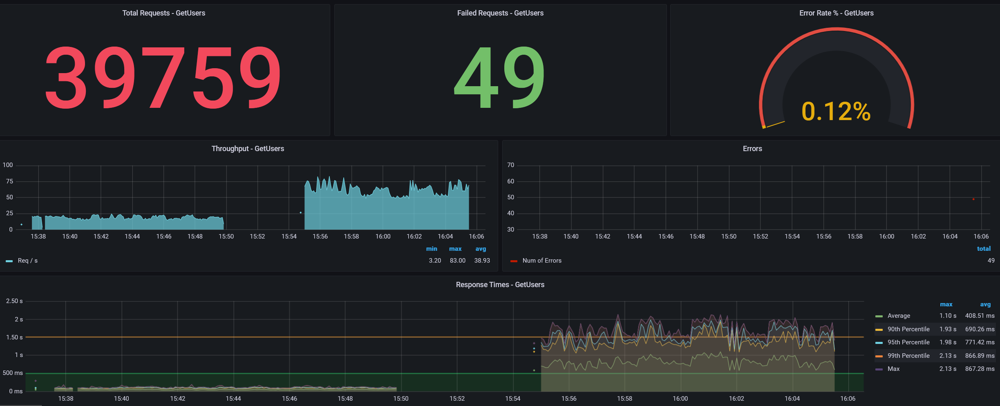

### Нагрузочное тестирование после создания индекса 1000 пользователями

Результат тестирования:

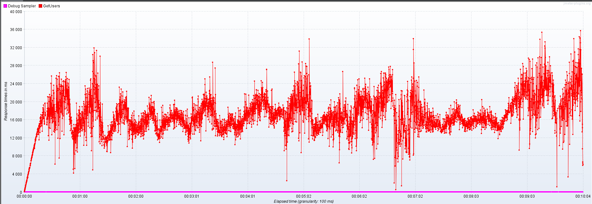

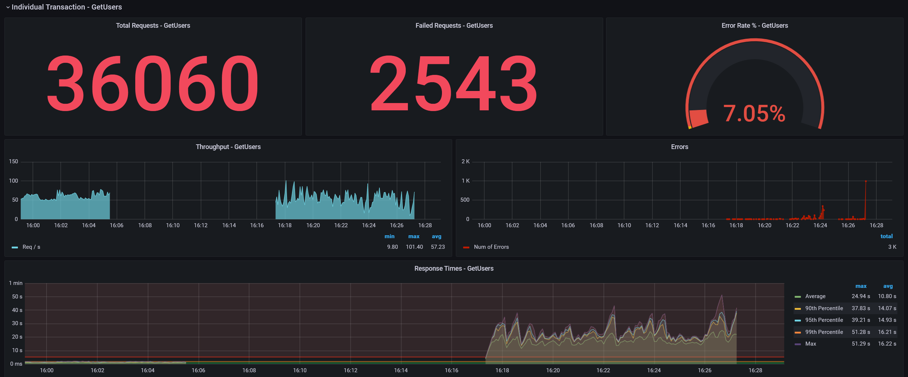

### Получение query plan при получении данных из таблицы с созданными индексами


## Нагрузочное тестирование V2

После проверки отчета и выявленных недостатков, решено повторить нагрузочное тестирование с другими индексами и немного другим SQL запросом.

### Измененный скрит для обращения к базе данных

```
public async Task<List<ProfileModelDb>> GetProfilesByFilter(string firstName, string lastName)
    {
        return await context.Profiles.FromSqlInterpolated(@$"
            SELECT 
                p.""ProfileId"",
                p.""UserId"", 
                p.""FirstName"", 
                p.""LastName"", 
                p.""BirthdayDate"", 
                p.""Gender"",
                p.""Description"", 
                p.""CityName"" 
            FROM ""Profiles"" p
            WHERE 
                (
                    p.""FirstName"" LIKE '%' || {firstName} || '%'
                    OR 
                    p.""LastName"" LIKE '%' || {lastName} || '%'
                )")
            .ToListAsync();
    }
```

### Измененные индексы для базы данных

```
-- GIN индекс для ускорения поиска по шаблону в FirstName
CREATE INDEX "IX_Profiles_FirstName_trigram"
ON "Profiles" USING gin ("FirstName" gin_trgm_ops);

-- GIN индекс для ускорения поиска по шаблону в LastName
CREATE INDEX "IX_Profiles_LastName_trigram"
ON "Profiles" USING gin ("LastName" gin_trgm_ops);

-- Составной индекс для полей FirstName и LastName
CREATE INDEX idx_firstname_lastname ON "Profiles" ("FirstName", "LastName");
```

### Нагрузочное тестирование до создания индекса 1000 пользователем V2


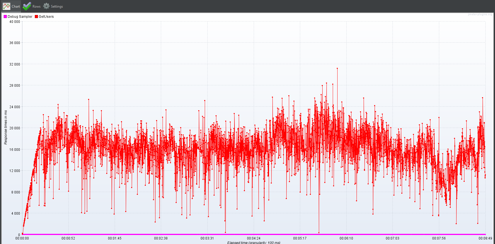

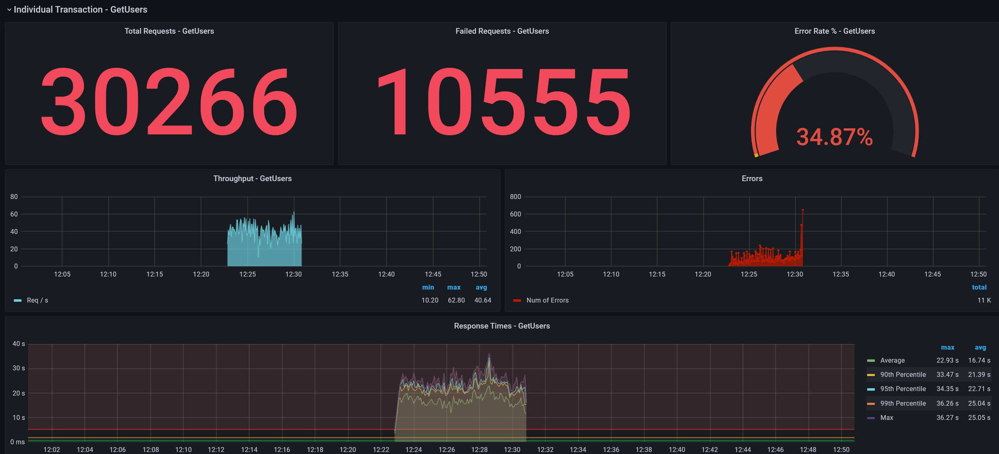

### Нагрузочное тестирование после создания индекса 1000 пользователем V2


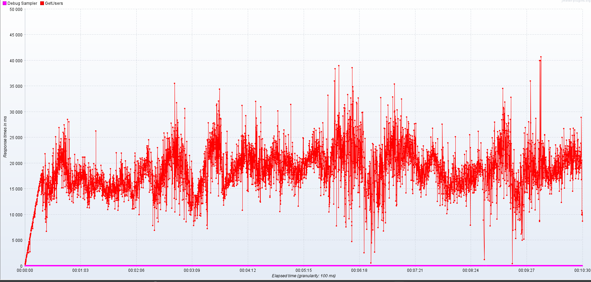

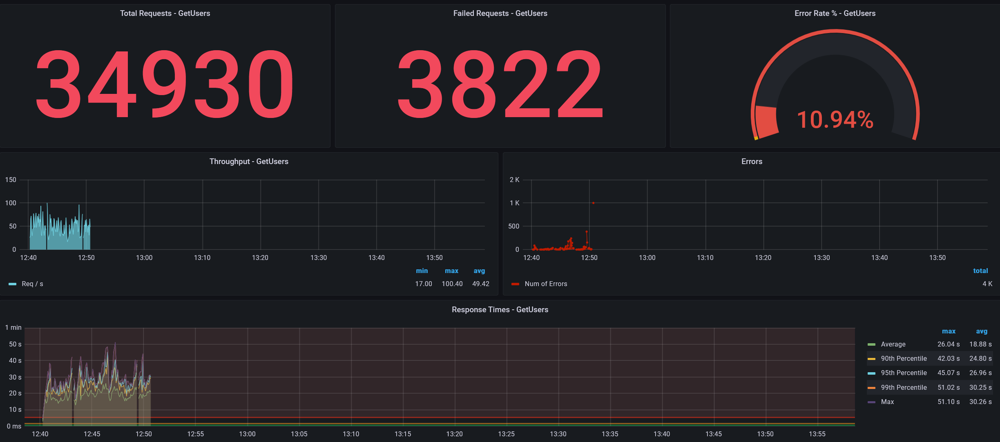

### Получение query plan при получении данных из таблицы с созданными индексами V2

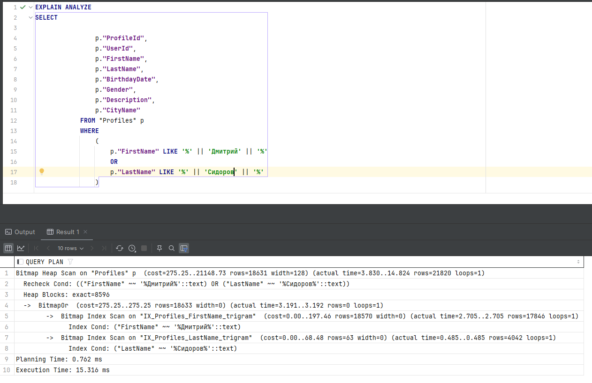

### Итоговые данные
#### V1
Таблица результатов до создания индексов:

| Количество пользователей | latency  | throughput | 90th percentile | 95th percentile | 99th percentile |
|-------------------------|----------|------------|-----------------|-----------------|-----------------|
| 1                       | ~60ms    | 15.8/sec   | 84ms            | 97ms            | 115ms           |
| 50                      | ~650ms   | 54.5/sec   | 1478ms          | 1672ms          | 2024ms          |
| 1000                    | ~12500ms | 87.9ms     | 13120ms         | 14360ms         | 24399ms         |

Таблица результатов после создания индексов:

| Количество пользователей | latency  | throughput | 90th percentile | 95th percentile | 99th percentile |
|-------------------------|----------|------------|-----------------|-----------------|-----------------|
| 1                       | ~50ms    | 18.9/sec   | 90ms            | 98ms            | 118ms           |
| 50                      | ~650ms   | 62.7/sec   | 1328ms          | 1508ms          | 1842ms          |
| 1000                    | ~12500ms | 89.7ms     | 24436ms         | 27700ms         | 34300ms         |

#### V2
Таблица результатов до создания индексов:

| Количество пользователей | latency  | throughput | 90th percentile | 95th percentile | 99th percentile |
|--------------------------|----------|------------|-----------------|-----------------|-----------------|
| 1000                     | ~15700ms | 64.2/sec   | 21243ms         | 22710ms         | 25867ms         |

Таблица результатов после создания индексов:

| Количество пользователей | latency  | throughput | 90th percentile | 95th percentile | 99th percentile |
|-------------------------|----------|------------|-----------------|-----------------|-----------------|
| 1000                    | ~18500ms | 55.5/sec   | 26016ms         | 29038ms         | 36638ms         |

Помимо этих показателей, хотелось бы выделить тот факт, что после добавления индексов, количество ошибок в процентом соотношении снизилось на 20%,
что, вероятно, повысило показатели обработки запроса: пойти в базу и достать данные дольше, чем бросишь исключение об ошибке.
Ошибки, в основном, связаны с ограничением по коннекшонам базы данных. На момент тестирования оно составляло 100 (по стандарту).
Так же было проведено тестирования с 50 запросами, аналогично, разница порядка 10-15%.

# Заключение

В результате работы были выполнены все необходимые этапы для нагрузочного тестирования.

# Материалы

- [Файл с пользовательскими данными](swipe-vibe-people-import.csv)
- [Скрипт импорта даннных в базу данных](LoadUserDataToDb.sql)
- [JMeter конфигурация](CreateIndexProfileAndUser.sql)
- [Создание индекса для базы данных](CreateIndexProfileAndUser.sql)